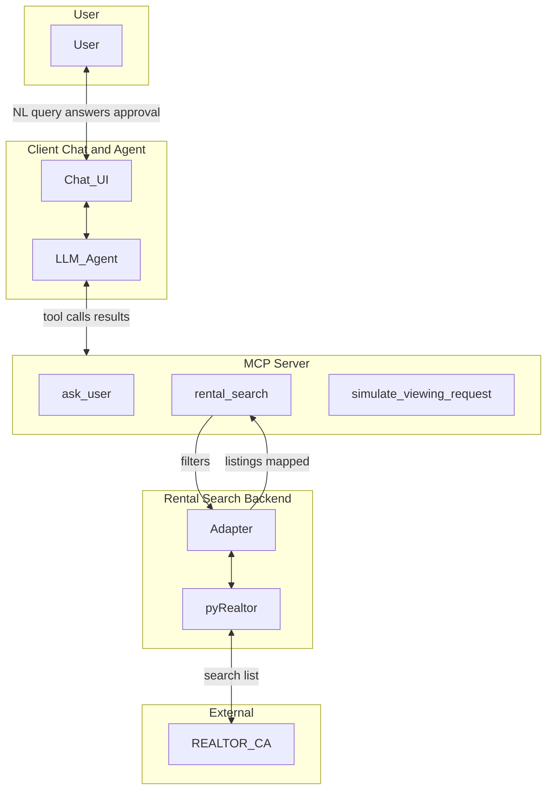

# Rental Search Assistant MVP — Implementation Plan (Full Scope)

## Scope (from [technical spec](docs/rental-search-assistant-mvp-technical-spec.md))

**In scope (all components in §2 System Architecture):**

- **Chat UI** — Renders conversation and agent prompts; sends user messages and tool answers (e.g. from `ask_user`) to the agent.
- **LLM Agent** — Parses intent, orchestrates the flow (§7), calls MCP tools, maintains state (§7.1), presents shortlist and final summary; handles errors and empty states (§8).
- **MCP Server** — Exposes three tools: `ask_user`, `rental_search`, `simulate_viewing_request`; handles tool invocation and return values.
- **Adapter** — Translates §4.1 filters into pyRealtor calls; maps pyRealtor output to §4.2 Listing shape; post-fetch filtering per spec.
- **pyRealtor** — Single backend; fetches from REALTOR.CA (Canada/Vancouver). No other backends.

**Out of scope (only):**

- **Apify backend** — The “Alternative (informational, not in MVP scope): Realtor.ca via Apify” in §6 is not implemented. No Apify client or Realtor.ca Property Search Scraper (Apify).

The spec’s “Out of scope: UI/channel details, specific LLM provider or prompt engineering” is interpreted as: we implement a working Chat UI and an agent that uses a configurable LLM (e.g. env-based API key and model), without prescribing a single vendor or deep prompt engineering.

---

## Architecture (per spec §2)

Data flow: User ↔ Chat UI ↔ LLM Agent ↔ MCP Server. For search: `rental_search` → Adapter → pyRealtor ↔ REALTOR.CA; adapter returns mapped listings. `ask_user` is resolved by the Chat UI (prompt user, send answer/selected back to the agent). `simulate_viewing_request` is stateless (summary + optional contact_url).

---

## 1. Project setup

- **Root:** [rental_search_agent](.) — add package and app code; keep [docs/](docs/) as-is.
- **Environment:** Use **Conda** to create and activate the project environment. Conda env name: `**realtor_agent**` (e.g. `conda create -n realtor_agent python=3.10`, `conda activate realtor_agent`). Install dependencies from `requirements.txt` with `pip` within the active conda environment.
- **Python:** 3.10+.
- **Dependencies:** `pyRealtor`, `mcp` (MCP Python SDK), `pydantic` (or dataclasses) for schemas; for the **client** (Chat UI + Agent runner): an LLM SDK (e.g. OpenAI-compatible client) so the agent can call tools and the client can resolve `ask_user` via the UI. Optional: `httpx` for async if needed.
- **Artifacts:** `requirements.txt`, `pyproject.toml` (optional), README. Env: e.g. `USE_PROXY` for pyRealtor; **OpenRouter** is the default LLM backend (`OPENROUTER_API_KEY`, `OPENROUTER_MODEL`); fallback: `OPENAI_API_KEY` and `OPENAI_MODEL`.

---

## 2. Data models and validation

- **Location:** e.g. `src/rental_search_agent/models.py` (or `rental_search_agent/models.py`).
- **Define per §4:**
  - **RentalSearchFilters** — §4.1: `min_bedrooms`, `max_bedrooms`, `min_bathrooms`, `max_bathrooms`, `min_sqft`, `max_sqft`, `rent_min`, `rent_max`, `location`, `listing_type`; require `min_bedrooms` and `location`; validate types and ranges.
  - **Listing** — §4.2: all fields (id, title, url, address, price, bedrooms, sqft, source, bathrooms, description, latitude, longitude, house_category, ownership_category, ammenities, nearby_ammenities, open_house, stories); required vs optional as in spec.
  - **UserDetails** — §4.3: name, email, phone, preferred_times.
- **Tool request/response shapes:** §5 — rental_search response `{ listings, total_count }`; ask_user response `{ answer }` or `{ selected }`; simulate_viewing_request response `{ summary, contact_url? }`.
- Use Pydantic (or dataclasses) and validate in tools and adapter; invalid input → clear tool errors (§8).

---

## 3. Rental search backend: adapter + pyRealtor

- **Location:** e.g. `src/rental_search_agent/adapter.py`.
- **Contract (per §6):** Accept §4.1 filters; return list of §4.2 Listing + `total_count`; on backend failure, raise (do not return empty list).
- **Steps:**
  1. Call pyRealtor: `HousesFacade().search_save_houses(search_area=filters.location, country='Canada', listing_type=filters.listing_type or 'for_rent', price_from=filters.rent_min, use_proxy=...)`. No Apify.
  2. Get result: use in-memory DataFrame if the facade exposes it; else read saved Excel and scope/clean so concurrent runs are safe.
  3. Post-fetch filtering (spec “Backend result columns (pyRealtor)” and “Post-fetch filtering”): coerce Bedrooms, Bathrooms, Size, Rent/Price to numeric; apply min/max for bedrooms, bathrooms, sqft, rent (or price); drop rows that fail.
  4. Map to Listing: MLS→id, Website→url, Address→address, Rent/Price→price, Bedrooms→bedrooms, Size→sqft (parse if string), Description→title/description, source=`"Realtor.ca"`; fill optional fields when present.
  5. Return `{ "listings": [...], "total_count": N }`.
  6. On exception/timeout: raise a structured error so the MCP layer returns a tool error (“The rental search is temporarily unavailable”) per §8.

---

## 4. MCP server and tools

- **Location:** e.g. `src/rental_search_agent/server.py` (entrypoint for the MCP server process).
- **Framework:** MCP Python SDK, stdio transport (so Cursor/Claude or our own client can run it as subprocess).
- **Tools:**
  1. **ask_user(prompt, choices?, allow_multiple?)** — Validate prompt (required), choices (optional array), allow_multiple (optional bool). Return `{ "answer": str }` or `{ "selected": list[str] }` per §5.1. When the **client** runs the agent and receives a tool call for `ask_user`, the **Chat UI** shows the prompt and choices to the user, collects the reply, and passes it as the tool result; the MCP server can either (a) be called by the client with the user’s response already supplied (e.g. client resolves ask_user and sends the result as the tool input), or (b) return a special “request_user_input” payload that the client interprets to show UI and then re-invoke with the real result. Implement (a) or (b) so that the end-to-end flow works: user sees prompt → user answers → agent gets `answer` or `selected`.
  2. **rental_search(filters)** — Validate filters (§4.1). Call adapter; on success return `{ listings, total_count }`; on error return MCP tool error (message as in §8). Never return empty list for failure.
  3. **simulate_viewing_request(listing_url, timeslot, user_details)** — Validate listing_url, timeslot, user_details (name, email required). Build summary and optional contact_url; return `{ summary, contact_url? }`. No HTTP POST or browser automation. Optional in-memory log for learning.
- **Tool schemas:** Declare input JSON schemas per §5 so the client can pass them to the LLM.
- **Error handling:** Per §8 (invalid filters, backend unavailable, invalid args for simulate).

---

## 5. LLM Agent (orchestration)

- **Location:** e.g. `src/rental_search_agent/agent.py` or inside the client app that runs the agent loop.
- **State (§7.1):** Parsed criteria (filters), viewing preference (string), shortlist (listings), user details (name, email, phone).
- **Flow (§7.2):** Parse → Clarify (ask_user for viewing times; optional geography) → Search (rental_search; on error or empty, follow §8) → Present shortlist → Approve (ask_user multi-select; if selected empty, acknowledge and stop) → Collect user details (ask_user or chat) → Simulate submit (simulate_viewing_request per selected listing) → Confirm (summary).
- **Mapping (§7.3):** When building approval choices, use stable identifiers (e.g. listing id or label+id) so `selected` maps back to listing url/title for simulate_viewing_request.
- **Error and empty states (§8):** No results → suggest relaxing filters, offer new search, no approval step. Search error → “search temporarily unavailable”, optional retry. User selects none → “No viewings requested”, stop. Invalid user details → remind once or allow placeholders.
- **LLM usage:** Agent uses an LLM (configurable API key and model) to interpret user messages and decide which tool to call with which arguments. Tool definitions and schemas are passed to the LLM; the client runs the loop (user message → LLM → tool call → if ask_user, Chat UI collects input and supplies tool result → LLM continues → … until final reply).

---

## 6. Chat UI

- **Location:** Part of the same app that runs the agent (e.g. `src/rental_search_agent/client.py` or `app.py`).
- **Role (per spec §2):** Renders conversation and agent prompts; sends user messages and tool answers (e.g. from ask_user) to the agent.
- **Behaviour:** User types natural-language query and later sees shortlist and confirmation. When the agent calls `ask_user`, the UI shows the prompt and choices (single-select or multi-select per allow_multiple), user responds, and the client sends that response as the tool result to the agent. No requirement for a specific UI framework (CLI or simple web both acceptable); enough to run the full flow and test MVP.

---

## 7. Integration: client app (Chat UI + Agent)

- **Single runnable:** e.g. `python -m rental_search_agent.client` or `python run_client.py`.
- **Responsibilities:** Start MCP server (in-process or subprocess); run agent loop with LLM; connect agent to MCP tools (in-process call or MCP client); provide Chat UI (CLI or web) so the user can send messages and respond to ask_user. When a tool call is `ask_user`, UI shows prompt/choices, gets user input, and returns `{ "answer": "..." }` or `{ "selected": [...] }` to the agent.
- **Config:** Env or config file for LLM API key and model; optional USE_PROXY for pyRealtor.

---

## 8. File and folder layout

- **Package:** e.g. `src/rental_search_agent/` or `rental_search_agent/`
  - `__init__.py`
  - `models.py` — RentalSearchFilters, Listing, UserDetails, tool response types.
  - `adapter.py` — pyRealtor adapter (filters → pyRealtor → post-filter → map to Listing).
  - `server.py` — MCP server entrypoint, three tools, validation and error mapping.
  - `agent.py` — Agent state and flow logic (§7); may be used by client.
  - `client.py` (or `app.py`) — Chat UI + agent runner, connects to MCP server and LLM.
- **Root:** `requirements.txt`, `README.md`, optional `pyproject.toml`.
- **docs/** — Unchanged (spec and MVP docs).

---

## 9. Implementation order

1. **Project setup** — conda env, requirements (pyRealtor, mcp, pydantic, LLM client), package layout.
2. **Data models** — RentalSearchFilters, Listing, UserDetails, tool request/response types; validation.
3. **Adapter** — pyRealtor call, result handling, post-fetch filtering, Listing mapping, errors.
4. **MCP server** — Register three tools with input schemas; implement handlers; map errors to tool errors.
5. **Agent** — State, flow (§7.2), mapping (§7.3), error/empty handling (§8).
6. **Client** — Chat UI (CLI or minimal web), agent loop, LLM integration, resolution of ask_user via UI.
7. **README** — Conda env setup, how to run MCP server and client, env vars, and that Apify backend is not used.

---

## 10. Explicitly out of scope

- **Apify backend** — No Apify client, no Realtor.ca Property Search Scraper (Apify). No code or config that calls Apify.
- Proximity verification, calendar, viewing request log, real form submission, multiple search engines (per MVP doc) remain out of scope.

