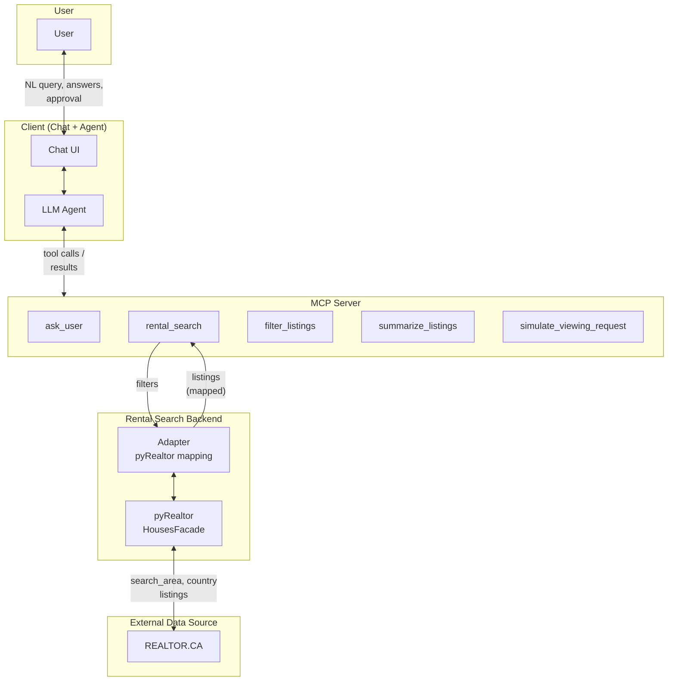

# Rental Search Assistant MVP — Technical Specification

This document provides implementation-ready technical specifications for the [Rental Search Assistant MVP](rental-search-assistant-mvp.md). It defines tool contracts, data shapes, error handling, and implementation notes.

---

## 1. Overview and References

| Item | Description |
|------|-------------|
| **Source** | [rental-search-assistant-mvp.md](rental-search-assistant-mvp.md) |
| **Scope** | MCP server (five tools), rental search backend adapter, agent orchestration behaviour |

---

## 2. System Architecture

The following diagram illustrates the in-scope components and how they interact. All references are to the MVP implementation (pyRealtor backend; Apify is out of scope).



| Component | Role |
|-----------|------|
| **User** | Supplies natural-language search, answers clarification and approval prompts (via Chat UI), receives shortlist and confirmation. |
| **Chat UI** | Renders conversation and agent prompts; sends user messages and tool answers (e.g. from `ask_user`) to the agent. |
| **LLM Agent** | Parses intent, orchestrates the flow (§7), calls MCP tools (`ask_user`, `rental_search`, `simulate_viewing_request`), presents shortlist and final summary. |
| **MCP Server** | Exposes five tools: `ask_user` (clarification/approval), `rental_search` (listings), `filter_listings` (narrow/sort results), `summarize_listings` (stats), `simulate_viewing_request` (simulated viewing request). Handles tool invocation and return values. |
| **Adapter** | Translates [§4.1](#41-rental-search-filters-input-to-rental_search) filters into pyRealtor calls; maps pyRealtor/REALTOR.CA output to [§4.2](#42-listing-item-in-search-results) Listing shape. |
| **pyRealtor** | Python package (`HousesFacade.search_save_houses`); fetches MLS data from REALTOR.CA for the given location (e.g. Vancouver). |
| **REALTOR.CA** | External listing source (Canada); provides listing data consumed by pyRealtor. |

**Data flow (summary):** User ↔ Client ↔ Agent ↔ MCP. For search: `rental_search` → Adapter → pyRealtor ↔ REALTOR.CA; Adapter returns mapped listings to `rental_search` → Agent. `ask_user` and `simulate_viewing_request` do not call external services in this diagram (user input for `ask_user` is gathered via the Client/UI).

### 2.1 LLM provider (OpenRouter)

The client uses **[OpenRouter](https://openrouter.ai)** as the default LLM backend: a single API (`https://openrouter.ai/api/v1`) and one API key provide access to 400+ models (OpenAI, Anthropic, Google, etc.) with a normalized chat-completions interface. The implementation uses the OpenAI-compatible Python client with `base_url` and `OPENROUTER_API_KEY`; model is selected via `OPENROUTER_MODEL` (e.g. `openai/gpt-4o-mini`, `anthropic/claude-3.5-sonnet`). If `OPENROUTER_API_KEY` is not set, the client falls back to direct OpenAI (`OPENAI_API_KEY`, `OPENAI_MODEL`).

---

## 3. Conventions

- **Currency:** CAD. All rent values in documents and APIs are in CAD/month unless otherwise noted.
- **Area:** Square feet (sqft). Optional field; omit if backend does not provide it.
- **IDs:** Listings use an opaque `id` (string) and a `url` (string). The agent uses both for display and for `simulate_viewing_request(listing_url, ...)`.
- **Location:** Free-form string (e.g. `"Vancouver"`, `"City of Vancouver"`, `"Metro Vancouver"`). Backend interprets; no geocoding in MVP.

---

## 4. Data Types and Schemas

### 4.1 Rental search filters (input to `rental_search`)

| Field | Type | Required | Description |
|-------|------|----------|-------------|
| `min_bedrooms` | number (integer) | Yes | Minimum number of bedrooms. |
| `max_bedrooms` | number (integer) | No | Maximum number of bedrooms. Omit for no upper limit. |
| `min_bathrooms` | number (integer) | No | Minimum number of bathrooms. |
| `max_bathrooms` | number (integer) | No | Maximum number of bathrooms. Omit for no upper limit. |
| `min_sqft` | number (integer) | No | Minimum square footage. Omit if not specified by user. |
| `max_sqft` | number (integer) | No | Maximum square footage. Omit for no upper limit. |
| `rent_min` | number | No | Minimum rent (CAD/month). |
| `rent_max` | number | No | Maximum rent (CAD/month). At least one of `rent_min` or `rent_max` should be set if user gave a range. |
| `location` | string | Yes | Location string (e.g. city or area name). |
| `listing_type` | string | No | Transaction type: `"for_rent"`, `"for_sale"`, or `"for_sale_or_rent"`. Default for rental assistant is `"for_rent"`; omit to use backend default. |

**Example:**

```json
{
  "min_bedrooms": 2,
  "max_bedrooms": 3,
  "min_sqft": 800,
  "max_sqft": 1200,
  "rent_min": 2500,
  "rent_max": 3000,
  "location": "Vancouver",
  "listing_type": "for_rent"
}
```

### 4.2 Listing (item in search results)

| Field | Type | Required | Description |
|-------|------|----------|-------------|
| `id` | string | Yes | Unique identifier for the listing (opaque; may be backend-specific). |
| `title` | string | Yes | Short title or headline. |
| `url` | string | Yes | Canonical URL for the listing (used for viewing request and “view listing” link). |
| `address` | string | Yes | Human-readable address or area. |
| `price` | number | Yes | Rent in CAD/month. |
| `bedrooms` | number | Yes | Number of bedrooms. |
| `sqft` | number | No | Square footage; omit if unknown. |
| `price_display` | string | No | Formatted price for presentation (e.g. `"$2,500/month"`). Omit if unknown. |
| `postal_code` | string | No | Postal code; omit if unknown. |
| `source` | string | No | Source name (e.g. `"Realtor.ca"`, `"Rentals.ca"`) for display. |
| `bathrooms` | number | No | Number of bathrooms; omit if unknown. |
| `description` | string | No | Full or extended listing description; omit if not needed for shortlist. |
| `latitude` | number | No | Latitude; for mapping or proximity. Omit if unknown. |
| `longitude` | number | No | Longitude; for mapping or proximity. Omit if unknown. |
| `house_category` | string | No | Property type (e.g. “House”, “Condo”, “Townhouse”). |
| `ownership_category` | string | No | Ownership type (e.g. “Condominium/Strata”, “Freehold”). |
| `ammenities` | string | No | Listed amenities; semicolon-separated or free text. |
| `nearby_ammenities` | string | No | Nearby features (transit, schools, etc.); semicolon-separated or free text. |
| `open_house` | string | No | Open house date/time text; omit if not applicable. |
| `stories` | number | No | Number of stories; omit if unknown. |

**Example:**

```json
{
  "id": "clx123abc",
  "title": "2BR Condo near Downtown",
  "url": "https://example.com/listings/clx123abc",
  "address": "123 Main St, Vancouver",
  "price": 2800,
  "bedrooms": 2,
  "bathrooms": 1,
  "sqft": 850,
  "source": "Realtor.ca",
  "house_category": "Condo",
  "ownership_category": "Condominium/Strata"
}
```

### 4.3 User details (for viewing request)

| Field | Type | Required | Description |
|-------|------|----------|-------------|
| `name` | string | Yes | User’s name. |
| `email` | string | Yes | Email for contact. |
| `phone` | string | No | Phone number; omit if not collected. |
| `preferred_times` | string | No | Free-text viewing preference (e.g. “weekday evenings 6–8pm”); typically from clarification. |

**Example:**

```json
{
  "name": "Jane Doe",
  "email": "jane@example.com",
  "phone": "+1 604 555 1234",
  "preferred_times": "Weekday evenings 6–8pm"
}
```

### 4.4 Timeslot (for simulate_viewing_request)

| Field | Type | Description |
|-------|------|-------------|
| `timeslot` | string | Human-readable slot chosen by the agent from the user’s viewing preference (e.g. `"Tuesday 6–8pm"`, `"Saturday 10am"`). No structured datetime required in MVP. |

---

## 5. MCP Tool Specifications

### 5.1 `ask_user`

**Purpose:** Clarification (single answer) and approval (multi-select). One tool for both; behaviour depends on `allow_multiple`.

**Arguments (JSON schema):**

| Parameter | Type | Required | Description |
|-----------|------|----------|-------------|
| `prompt` | string | Yes | Question or instruction shown to the user. |
| `choices` | array of strings | No | Predefined options. If omitted or empty, user may answer in free text. |
| `allow_multiple` | boolean | No | Default `false`. If `true`, user may select zero or more choices; if `false` or omitted, single selection or single free-text answer. |

**Usage:**

- **Clarification (single answer):** `allow_multiple: false` or omit. Examples: preferred days/times for viewings, geography (e.g. “City of Vancouver” vs “Metro Vancouver”). Store the returned value in agent state (e.g. viewing preference, location).
- **Approval (multi-select):** `allow_multiple: true`. Example: “Which listings do you want to request viewings for?” with choices = listing labels or IDs. Returned value = array of selected option(s); may be empty.

**Response shape:**

- **Single-answer mode:** `{ "answer": string }` — the chosen option or free-text reply.
- **Multi-select mode:** `{ "selected": string[] }` — list of selected choice strings (may be empty).

**Implementation notes:**

- MCP server may render `prompt` and `choices` in the client UI (e.g. buttons, dropdown, multi-select). How the client surfaces this is implementation-defined; the agent only receives the structured response.
- For listing approval, choices should be identifiable (e.g. include listing `id` or a short label plus `id`) so the agent can map `selected` back to listing URLs/IDs.

**Errors:**

- No specific tool errors required for MVP. Invalid arguments (e.g. non-string prompt) may return a generic MCP/tool error.

---

### 5.2 `rental_search`

**Purpose:** Run a single logical search against the one supported rental backend; return a list of listings (shortlist).

**Arguments (JSON schema):**

| Parameter | Type | Required | Description |
|-----------|------|----------|-------------|
| `filters` | object | Yes | See [§4.1 Rental search filters](#41-rental-search-filters-input-to-rental_search). Must include `min_bedrooms` and `location`; other fields optional. |

**Response shape:**

```json
{
  "listings": [
    { "id": "...", "title": "...", "url": "...", "address": "...", "price": 0, "bedrooms": 0, "sqft": 0, "source": "..." }
  ],
  "total_count": 0
}
```

| Field | Type | Description |
|-------|------|-------------|
| `listings` | array of [Listing](#42-listing-item-in-search-results) | List of listings (may be empty). Order is backend-defined (e.g. relevance, price). |
| `total_count` | number | Total number of listings matching the query. May equal `listings.length` if no pagination; if backend paginates, may be larger. MVP: agent performs one logical call; backend may perform multiple API calls internally and return a single merged list. |

**Pagination (backend):**

- From the agent’s perspective this is a **single logical search**: one tool call, one response.
- The backend may call the rental API multiple times (e.g. page 1, 2, …) and merge results, or return the first page only. Document the chosen behaviour (e.g. “first 50 results only” or “all pages up to 100”).

**Errors:**

- **Backend unavailable / timeout:** Return a structured error (e.g. MCP tool error with `code: "search_unavailable"` or similar) and message suitable for the agent to show the user (e.g. “The rental search is temporarily unavailable.”). Do not return an empty list to indicate failure.
- **Invalid filters:** If `min_bedrooms` or `location` missing or invalid, return a tool error with a clear message so the agent can correct and retry.

---

### 5.3 `filter_listings`

**Purpose:** Narrow and/or sort the current search results in-memory. Used when the user asks to filter (e.g. “only 1 bathroom”, “under 2500”) or sort (e.g. “sort by price”, “cheapest first”). Operates on the most recent `rental_search` or `filter_listings` result.

**Arguments (JSON schema):**

| Parameter | Type | Required | Description |
|-----------|------|----------|-------------|
| `listings` | array of [Listing](#42-listing-item-in-search-results) | Yes | Current list from last rental_search or filter_listings. The chat client derives this from message history; MCP clients must pass explicitly. |
| `filters` | object | No | Optional criteria: `min_bedrooms`, `max_bedrooms`, `min_bathrooms`, `max_bathrooms`, `min_sqft`, `max_sqft`, `rent_min`, `rent_max`. All optional. |
| `sort_by` | string | No | Attribute to sort by: `"price"`, `"bedrooms"`, `"bathrooms"`, `"sqft"`, `"address"`, `"id"`, `"title"`. |
| `ascending` | boolean | No | Default `true`. If true, sort ascending (e.g. cheapest first); if false, descending. |

At least one of `filters` (with non-empty criteria) or `sort_by` is required.

**Response shape:** Same as `rental_search`: `{ "listings": [...], "total_count": N }`.

---

### 5.4 `summarize_listings`

**Purpose:** Compute statistics for the current search results (price min/median/mean/max, bedroom/bathroom distribution, size stats, property types). Used when presenting results to produce a structured summary.

**Arguments:** `listings` (array of Listing) — the current list from last rental_search or filter_listings. The chat client derives this from message history; MCP clients must pass explicitly.

**Response shape:** A stats dict (count, price, bedrooms, bathrooms, sqft, house_category).

---

### 5.5 `simulate_viewing_request`

**Purpose:** “Submit” a viewing request without real form POST or browser automation. Returns a summary and/or link (e.g. mailto, contact URL) for learning and user feedback.

**Arguments (JSON schema):**

| Parameter | Type | Required | Description |
|-----------|------|----------|-------------|
| `listing_url` | string | Yes | Canonical URL of the listing (from search result `url`). |
| `timeslot` | string | Yes | Human-readable timeslot (e.g. “Tuesday 6–8pm”). Agent derives from user’s stated viewing preference. |
| `user_details` | object | Yes | See [§4.3 User details](#43-user-details-for-viewing-request). Must include `name` and `email`; `phone` and `preferred_times` optional. |

**Response shape:**

```json
{
  "summary": "Viewing request [simulated] for [listing title or URL] at [timeslot]. Contact: [name], [email].",
  "contact_url": "mailto:landlord@example.com?subject=..."
}
```

| Field | Type | Description |
|-------|------|-------------|
| `summary` | string | Human-readable one-line or short paragraph for the agent to show the user. |
| `contact_url` | string | Optional. mailto link or pre-filled contact URL so the user can send the request manually if desired. Omit if not applicable. |

**Behaviour:**

- No HTTP POST to listing sites, no browser automation, no persistence required. Optional in-memory log for learning is acceptable.
- Tool may append to an in-memory list of “simulated” requests for the session (e.g. for a final summary). Not required by this spec.

**Errors:**

- Invalid or missing `listing_url` / `user_details`: return tool error with message. Agent should not call with empty `name` or `email` after collecting user details; if validation fails, agent can re-prompt once or use placeholders for learning (see MVP error states).

---

## 6. Rental Search Backend (Adapter) Contract

The MCP server’s `rental_search` tool talks to a **single** rental backend (API or scraper). The adapter must:

1. **Accept** a filter object conforming to [§4.1](#41-rental-search-filters-input-to-rental_search).
2. **Return** an array of objects conforming to [§4.2 Listing](#42-listing-item-in-search-results), plus an optional `total_count`.
3. **Handle errors** by throwing or returning a structured error to the MCP layer (so the tool can return a tool error, not an empty list).
4. **Pagination:** Document whether the adapter returns first page only or aggregates multiple pages; document max results if capped.

### Chosen backend (MVP): Realtor.ca via pyRealtor

**In scope for MVP:** [pyRealtor](https://pypi.org/project/pyRealtor/) — Python package (MIT) that fetches MLS listings from [REALTOR.CA](https://www.realtor.ca) for Canadian areas, including Vancouver. No per-result or platform fees; suitable for development and low-volume use. The adapter accepts [§4.1](#41-rental-search-filters-input-to-rental_search) filters, calls pyRealtor, and maps results to the [Listing](#42-listing-item-in-search-results) shape.

**Integration pattern:**

- **Environment:** Use [Conda](https://docs.conda.io/) to create and activate the project environment. Conda env name: **`realtor_agent`** (e.g. `conda create -n realtor_agent python=3.10`; `conda activate realtor_agent`). Then install dependencies with pip within that environment.
- **Install:** `pip install pyRealtor` (Python ≥3.6). Dependencies include `requests`, `pandas`, `lxml`, `openpyxl`.
- **Entry point:** `pyRealtor.HousesFacade()`. Use `search_save_houses(search_area=<location>, country='Canada')` so that `search_area` is set from `filters["location"]` (e.g. `"Vancouver"`, `"Barrhaven"`). For ambiguous names, pass `country='Canada'`.
- **Rate limiting:** REALTOR.CA may rate-limit or block IPs under heavy use. Use `search_save_houses(..., use_proxy=True)` if needed; the package supports a proxy option.
- **Output:** The package writes data to Excel by default. The adapter should use any in-memory return value the facade exposes (e.g. DataFrame or list of records) if available; otherwise read from the saved file and map to [Listing](#42-listing-item-in-search-results). Map fields (id, address, price, bedrooms, sqft if present, listing URL) and set `source: "Realtor.ca"`. Handle missing optional fields (e.g. `sqft`).
- **Rentals:** REALTOR.CA supports rental listings. If pyRealtor exposes a transaction-type or “for rent” parameter, the adapter should use it for rental-only results; otherwise filter or constrain results to rentals as the package allows.
- **Pagination / limit:** Document adapter behaviour (e.g. single logical search; pyRealtor may have its own result limits—see package docs).

**Backend result columns (pyRealtor):** The pyRealtor backend returns a DataFrame (or Excel) with the following columns. The adapter uses these for **mapping** to the [Listing](#42-listing-item-in-search-results) shape and for **post-fetch filtering** when the backend does not support a filter (e.g. `rent_max`, `max_bedrooms`).

| Column | Type / notes | Use for |
|--------|----------------|--------|
| **MLS** | string | Listing `id`. |
| **Bedrooms** | number (or string; coerce to numeric) | Map to `bedrooms`; post-filter by `min_bedrooms`, `max_bedrooms`. |
| **Bathrooms** | number (or string; coerce to numeric) | Post-filter by `min_bathrooms`, `max_bathrooms`. |
| **Size** | string or number (e.g. sqft; may need parsing) | Map to `sqft` if present; post-filter by `min_sqft`, `max_sqft`. |
| **Price** | number/string (for sale) | Post-filter by price range when `listing_type` is for_sale. |
| **Rent** | number/string (for rent) | Map to `price` when Total Rent is absent; post-filter by `rent_min`, `rent_max`. |
| **Total Rent** | number (for rent) | Prefer over Rent when present for `price` and filtering. |
| **Address** | string | Map to `address`. |
| **Description** | string | Use for `title` or description if no dedicated title. |
| **Website** | string | Map to `url`. |
| **Total Rent** | number (for rent) | When `listing_type` is for_rent, use for `price` and filtering; prefer over Rent when present. |
| **Latitude**, **Longitude** | number | Optional; for mapping/proximity. |
| **House Category**, **Ownership Category** | string | Optional metadata. |
| **Open House**, **Ammenities**, **Nearby Ammenities**, **Stories** | string | Optional metadata. |
| **Postal Code** | string | Optional; map to `postal_code`. |

**Post-fetch filtering:** Apply `min_bedrooms`, `max_bedrooms`, `min_bathrooms`, `max_bathrooms`, `min_sqft`, `max_sqft`, `rent_min`, and `rent_max` on these columns when the backend does not support them as search parameters. Coerce numeric columns and handle missing or invalid values before filtering.

**Terms:** Data is from REALTOR.CA (CREA). Use consistent with [REALTOR.CA terms of use](https://www.realtor.ca/terms-of-use); typically private, non-commercial use.

---

### Alternative (informational, not in MVP scope): Realtor.ca via Apify

**Out of scope for MVP.** Kept for reference if a hosted, pay-per-result backend is needed later.

**Actor:** [Realtor.ca Property Search Scraper](https://apify.com/stealth_mode/realtor-property-search-scraper) (`stealth_mode/realtor-property-search-scraper`) on Apify. Scrapes Realtor.ca (Canada, including Vancouver rentals). **Billing:** Pay-per-result (~$3 per 1,000 results); no separate platform compute for this actor; Apify’s $5/month free credits apply.

**Integration (when used):** [Apify Python client](https://docs.apify.com/api/client/python) (`pip install apify-client`). Use `ApifyClient` with an API token (Apify Console → Integrations). Run actor with input `{ "urls": [...], "max_items_per_url": N, "ignore_url_failures": true }` (URLs built from filters). Sync run: `client.actor("stealth_mode/realtor-property-search-scraper").call(run_input=...)` then `client.dataset(run["defaultDatasetId"]).iterate_items()`. Map actor output (e.g. `id`, `property.address`, `property.price`, `building.bedrooms`, listing URL) to [Listing](#42-listing-item-in-search-results); set `source: "Realtor.ca"`.

---

## 7. Agent Implementation Notes

### 7.1 State to maintain

- **Parsed criteria:** `min_bedrooms`, `max_bedrooms`, `min_bathrooms`, `max_bathrooms`, `min_sqft`, `max_sqft`, `rent_min`, `rent_max`, `location`, `listing_type` (updated after optional geography clarification).
- **Viewing preference:** Free-text string from required `ask_user` (e.g. “weekday evenings 6–8pm”). Used when calling `simulate_viewing_request` to choose a `timeslot`.
- **Shortlist:** The `listings` array from the last successful `rental_search` or `filter_listings` call.
- **User details:** After approval step, collect once: `name`, `email`, `phone` (optional). Reuse for every `simulate_viewing_request` in that flow.

### 7.2 Flow and tool-call sequence

1. **Parse** user message → extract filters (and note if location is ambiguous).
2. **Clarify geography (optional)** → If location ambiguous, `ask_user` for geography. Do not ask for viewing times yet.
3. **Search** → `rental_search(filters)`. If error → inform user, optionally retry once (see MVP error states). If empty list → do not call approval; suggest relaxing filters and offer to search again.
4. **Present** → Call `summarize_listings` to get statistics, then produce a bullet-point summary (Count, Price, Bedrooms, Bathrooms, Size, Property types). Results are shown in a table (and optionally a map when coordinates exist). Point user to the table.
5. **Narrow/sort (optional)** → If user asks to filter or sort, call `filter_listings` with criteria and/or sort options, then `summarize_listings` again and re-present.
6. **Confirm results** → `ask_user` to confirm results look good or need refining before choosing listings for viewing. If refine → loop to step 5; if good → continue.
7. **Viewing preference** → `ask_user` (single answer) for preferred days and times for viewings. Store as viewing preference. Only ask after results are presented.
8. **Approve** → `ask_user(prompt, choices = listing labels/ids, allow_multiple: true)`. If `selected` is empty → acknowledge “No viewings requested.” and stop (no user-details collection, no simulate).
9. **Collect user details** → If not already in state, use chat or `ask_user` to get name, email, phone. Validate minimally.
10. **Verify contact** → Before simulate, show user details and ask for confirmation via `ask_user`.
11. **Simulate submit** → For each selected listing, choose a timeslot string from viewing preference, then `simulate_viewing_request(listing_url, timeslot, user_details)`.
12. **Confirm** → Reply with summary of simulated requests (listings and times).

### 7.3 Mapping approval choices back to listings

When building `ask_user` choices for approval, use a stable identifier (e.g. listing `id` or a short label + `id`) so that the returned `selected` array can be mapped back to the full listing objects (and thus `url`, `title`) for the simulate step. Example: choices = `["[1] 123 Main St — $2800", "[2] 456 Oak Ave — $2600"]` with a parallel map from choice string to listing, or choices = `["id:clx123abc", "id:clx456def"]` and look up by `id`.

---

## 8. Error Handling Summary

| Layer | Condition | Behaviour |
|-------|-----------|-----------|
| **rental_search** | Backend error / timeout | Return MCP tool error (do not return empty list). Agent shows “search temporarily unavailable” and optionally suggests retry. |
| **rental_search** | Invalid filters | Return tool error with message. Agent corrects and retries. |
| **rental_search** | Success, 0 results | Return `{ listings: [], total_count: 0 }`. Agent does not run approval; suggests relaxing filters and offers new search. |
| **ask_user** | User selects none (approval) | Response `{ selected: [] }`. Agent acknowledges and stops; no user details, no simulate. |
| **simulate_viewing_request** | Missing/invalid args | Return tool error. Agent should have collected user details beforehand; if validation fails, re-prompt once or use placeholders. |

---

## 9. Optional: JSON Schema Snippets

For implementers who want to validate inputs/outputs, below are minimal JSON Schema fragments.

**RentalSearchFilters:**

```json
{
  "type": "object",
  "required": ["min_bedrooms", "location"],
  "properties": {
    "min_bedrooms": { "type": "integer", "minimum": 0 },
    "max_bedrooms": { "type": "integer", "minimum": 0 },
    "min_bathrooms": { "type": "integer", "minimum": 0 },
    "max_bathrooms": { "type": "integer", "minimum": 0 },
    "min_sqft": { "type": "number", "minimum": 0 },
    "max_sqft": { "type": "number", "minimum": 0 },
    "rent_min": { "type": "number", "minimum": 0 },
    "rent_max": { "type": "number", "minimum": 0 },
    "location": { "type": "string", "minLength": 1 },
    "listing_type": { "type": "string", "enum": ["for_rent", "for_sale", "for_sale_or_rent"] }
  }
}
```

**Listing:**

```json
{
  "type": "object",
  "required": ["id", "title", "url", "address", "price", "bedrooms"],
  "properties": {
    "id": { "type": "string" },
    "title": { "type": "string" },
    "url": { "type": "string", "format": "uri" },
    "address": { "type": "string" },
    "price": { "type": "number", "minimum": 0 },
    "bedrooms": { "type": "number", "minimum": 0 },
    "sqft": { "type": "number", "minimum": 0 },
    "source": { "type": "string" },
    "bathrooms": { "type": "number", "minimum": 0 },
    "description": { "type": "string" },
    "latitude": { "type": "number" },
    "longitude": { "type": "number" },
    "house_category": { "type": "string" },
    "ownership_category": { "type": "string" },
    "ammenities": { "type": "string" },
    "nearby_ammenities": { "type": "string" },
    "open_house": { "type": "string" },
    "stories": { "type": "number", "minimum": 0 }
  }
}
```

**UserDetails (for viewing):**

```json
{
  "type": "object",
  "required": ["name", "email"],
  "properties": {
    "name": { "type": "string", "minLength": 1 },
    "email": { "type": "string", "format": "email" },
    "phone": { "type": "string" },
    "preferred_times": { "type": "string" }
  }
}
```

---

## 10. Document History

| Version | Date | Change |
|---------|------|--------|
| 0.1 | Feb 17, 2026 | Initial technical spec derived from rental-search-assistant-mvp.md. |
| 0.2 | Feb 20, 2026 | Added `filter_listings` and `summarize_listings` tools; Listing fields `price_display`, `postal_code`; backend columns Total Rent, Postal Code; updated agent flow (steps 4–12) and MCP server component table. |
| 0.2 | Feb 20, 2026 | Added `filter_listings` and `summarize_listings` tools; Listing fields `price_display`, `postal_code`; backend columns Total Rent, Postal Code; updated agent flow (steps 4–12) and MCP server component table. |
