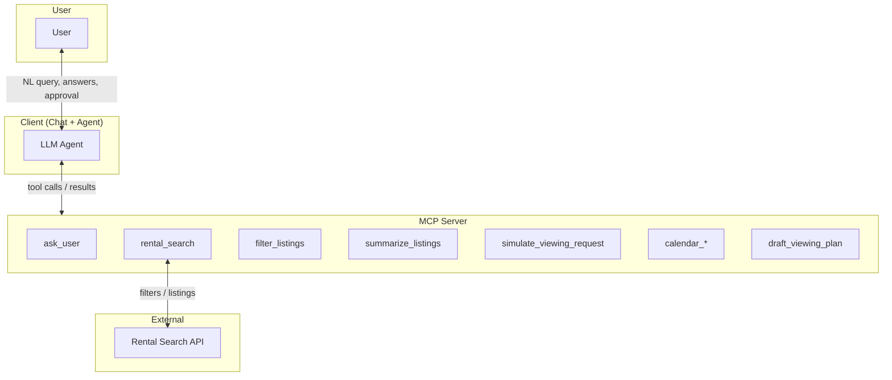
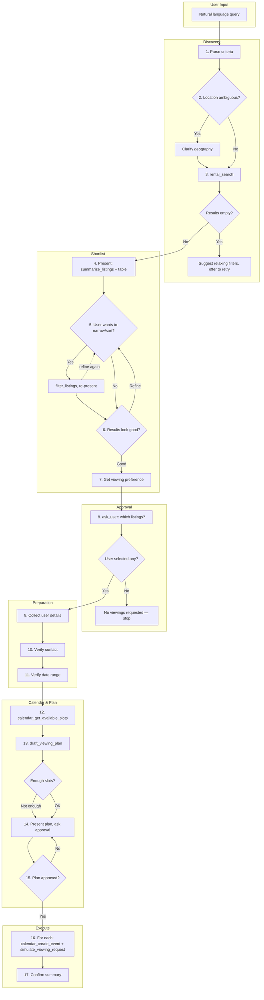

# Rental Search Assistant — MVP (Learning Scope)

A minimal, learning-focused version of the [Rental Search Assistant](rental-search-assistant-use-case.md). This MVP keeps the core agent flow (parse → clarify → search → shortlist → approve → “submit”) while excluding components that require heavy external integrations or browser automation.

---

## Architecture

The following diagram shows the main components and how they interact in the MVP.

| Component | Role |
|-----------|------|
| **User** | Supplies natural-language search, answers clarification and approval prompts, receives shortlist and confirmation. |
| **Client (Chat + Agent)** | Chat UI and LLM agent: parses intent, orchestrates the flow, calls MCP tools, presents shortlist and final summary. |
| **MCP Server** | Exposes twelve tools: `ask_user`, `rental_search`, `filter_listings`, `summarize_listings`, `simulate_viewing_request`, `calendar_list_events`, `calendar_get_available_slots`, `calendar_create_event`, `calendar_update_event`, `calendar_delete_event`, `draft_viewing_plan`, `modify_viewing_plan`. |
| **Rental Search API** | Single external source used by `rental_search` to return listings (API or scraped site). |

---

## MVP Scope

### In scope

| Component | Description |
|-----------|-------------|
| **Intent parsing** | Parse natural language into structured search criteria (beds, sqft, rent range, location). |
| **Basic clarification** | At least one required question: **preferred days and times for viewings**. Optionally one geography question (e.g. City of Vancouver vs Metro Vancouver). |
| **Single search engine** | One `rental_search(filters)` call against one API or one scraped site. |
| **Shortlist** | Present search results as the shortlist (filtering = whatever the search engine supports). No proximity verification. |
| **User approval** | Ask user which listings they want to request viewings for (multi-select). |
| **Simulated viewing request** | A tool that "submits" a viewing request by returning a summary or link (e.g. mailto / pre-filled URL). No real form submission or browser automation. |
| **Calendar integration** | Google Calendar API: list events, get available slots within preferred times, create/update/delete events. Optional; agent can fall back to simulated-only flow if credentials missing. |
| **Viewing plan** | `draft_viewing_plan` assigns slots to listings, clustering nearby listings (by lat/lon) to minimize commute. `modify_viewing_plan` allows add/remove/update of plan entries when the user wants changes. User approves plan before events are created. | “submits” a viewing request by returning a summary or link (e.g. mailto / pre-filled URL). No real form submission or browser automation. |

### Out of scope (for later)

| Component | Reason |
|-----------|--------|
| **Proximity verification** | Geocoding, routing/transit APIs, and config (downtown, skytrain) add significant setup. |
| ~~Viewing plan editing~~ | Now in scope: `modify_viewing_plan` allows add/remove/update of entries before approval. |
| **Viewing request log / double-booking** | No persistent log or slot-dedup; optional in-memory only. |
| **Real form submission** | No browser automation or platform-specific form adapters; submission is simulated. |
| **Multiple search engines** | One source only. |
| **Rich clarification** | No “which downtown?”, “which skytrain line?”, “which search source?” in MVP. |

---

## Example User Search (MVP)

User says something like:

> *"I'm looking for a 2+ bedroom, at least 800 sqft, 2500–3000 CAD/month in Vancouver."*

**Structured criteria (parsed by agent):**

| Criterion   | Value                    |
|------------|---------------------------|
| Min bedrooms | 2                      |
| Min sqft   | 800                       |
| Rent range | 2500–3000 CAD/month     |
| Location   | Vancouver (or clarified)  |

Proximity constraints (e.g. walk to skytrain, drive to downtown) are **not** enforced in the MVP; the shortlist is whatever the search engine returns for the above filters.

---

## 1. Intent and Clarification (MVP)

- **Parse** natural language into: min bedrooms, min sqft, rent range, location.
- **Required clarification:** Ask for **preferred days and times for viewings** (e.g. “weekday evenings 6–8pm”, “weekends 10am–2pm”). Store as *viewing preference* and use it when simulating viewing requests.
- **Optional clarification:** One geography question if location is ambiguous (e.g. City of Vancouver vs Metro Vancouver).
- **MCP:** `ask_user(prompt, choices[], allow_multiple?)` — the same tool is used for both single-answer clarification and multi-select approval. When `allow_multiple` is true (or an equivalent convention), the user may select zero or more options; when false or omitted, the user gives a single answer (e.g. viewing times, geography). Use single-answer for clarification steps and multi-select for “which listings do you want to request viewings for?”

---

## 2. Search (MVP)

- **Tool:** `rental_search(filters)` with e.g. `min_bedrooms`, `min_sqft`, `rent_min`, `rent_max`, `location`.
- **Backend:** One rental API or one scraped site (no multiple engines).
- **Return shape:** List of listings, e.g.  
  `{ id, title, url, address, price, bedrooms, sqft?, source, bathrooms?, latitude?, longitude?, ... }`. Streamlit UI shows a table and map (when coordinates exist).
- Agent calls this **once** after clarification. The result list is the **shortlist** (no verification step). This is a single *logical* search from the agent’s perspective; the backend may use one or more API calls internally (e.g. for pagination).

---

## 3. Shortlist and User Approval (MVP)

- **Shortlist:** Agent presents the search results (key fields: title, address, price, url).
- **Approval:** `ask_user` with multi-select: “Which listings do you want to request viewings for?” → user selects subset.
- Agent receives the selected listing IDs/urls and proceeds to “submit” (simulated) for those only.

---

## 4. Simulated Viewing Request (MVP)

- **Tool:** e.g. `simulate_viewing_request(listing_url, timeslot, user_details)` or `submit_viewing_request(..., simulate: true)`.
- **Behaviour:** No real form POST or browser automation. The tool returns a summary such as:  
  *“Viewing request for [listing] at [timeslot] with message: …”* and/or a mailto or contact URL.
- **Slots:** Agent picks times from the user’s **stated viewing preference** (e.g. “Tuesday 6–8pm”). No calendar API; no viewing log required (optional in-memory list for learning only).
- **User details:** Name, email, phone, and preferred times (from clarification). Collect **once** before the first `simulate_viewing_request`, e.g. right after the user approves which listings they want (see Agent Flow). Use `ask_user` or chat to gather name, email, and phone if not already provided.

---

## 5. MCP Server Surface (MVP Summary)

| Kind  | Name | Role |
|-------|------|------|
| Tool  | `ask_user(prompt, choices[], allow_multiple?)` | Same tool for clarification (single answer) and approval (multi-select). Use `allow_multiple: true` for “which listings?”; false/omitted for viewing times, geography, etc. |
| Tool  | `rental_search(filters)` | Search one rental engine; return listing list. |
| Tool  | `filter_listings(filters?, sort_by?, ascending?)` | Narrow and/or sort current search results in-memory. Operates on last rental_search/filter_listings result. |
| Tool  | `summarize_listings()` | Compute statistics (price, bedrooms, bathrooms, size, property types) for current results. Operates on last rental_search/filter_listings result. |
| Tool  | `simulate_viewing_request(listing_url, timeslot, user_details)` | "Submit" viewing request (no real form; return summary/link). |
| Tool  | `calendar_list_events(time_min, time_max, ...)` | List events in time range. |
| Tool  | `calendar_get_available_slots(preferred_times, date_range_start?, date_range_end?, ...)` | Get available slots. Call before draft_viewing_plan. |
| Tool  | `calendar_create_event(summary, start_datetime, end_datetime, ...)` | Create calendar event for viewing. |
| Tool  | `calendar_update_event(event_id, ...)` | Update calendar event. |
| Tool  | `calendar_delete_event(event_id)` | Delete calendar event. |
| Tool  | `draft_viewing_plan(listings, available_slots)` | Assign slots to listings; call immediately after calendar_get_available_slots. |
| Tool  | `modify_viewing_plan(remove?, add?, update?)` | Add, remove, or update plan entries when user wants changes in Step 11. | “Submit” viewing request (no real form; return summary/link). |

**Not in MVP:** `check_proximity`, `get_available_timeslots`, `get_viewing_requests`, `log_viewing_request`, real `submit_viewing_request`, resources like `user_profile://contact` or `config://proximity`.

---

## 6. Agent Flow (MVP End-to-End)

### Workflow Diagram

The diagram below captures the agent's end-to-end workflow: parse → clarify → search → shortlist → approve → execute.

| Phase | Steps | Key Tools |
|-------|-------|-----------|
| Discovery | 1–3 | Parse (LLM), `ask_user`, `rental_search` |
| Shortlist | 4–7 | `summarize_listings`, `filter_listings`, `ask_user` |
| Approval | 8 | `ask_user` (multi-select) |
| Preparation | 9–11 | `ask_user` (gather details, verify) |
| Calendar & Plan | 12–15 | `calendar_get_available_slots`, `draft_viewing_plan`, `ask_user` |
| Execute | 16–17 | `calendar_create_event`, `simulate_viewing_request` |

---

### Flow Steps (Detailed)

1. **Parse** — From user message, extract: beds, sqft, rent range, location.
2. **Clarify geography (optional)** — If location ambiguous, `ask_user` for geography. Do not ask for viewing times yet.
3. **Search** — Call `rental_search(filters)` once; result list = shortlist. If no results, see [Error and empty states](#8-error-and-empty-states-mvp).
4. **Present** — Call `summarize_listings` and produce a bullet-point summary. Show shortlist in a table (and optionally a map when coordinates exist).
5. **Narrow/sort (optional)** — If user asks to filter or sort, call `filter_listings` with criteria and/or sort options, then `summarize_listings` again and re-present.
6. **Confirm results** — `ask_user` to confirm results look good or need refining before choosing listings. If refine, loop to step 5; if good, continue.
7. **Viewing preference** — Call `ask_user` (single-answer) for **preferred days and times for viewings** (required). Store viewing preference. Only ask after results are presented.
8. **Approve** — `ask_user` with multi-select: which listings to request viewings for. If user selects none, confirm and stop (no simulate step).
9. **Collect user details** — Before the first viewing request, collect name, email, and phone via `ask_user` or chat if not already known.
10. **Verify contact** — Show user details and ask for confirmation before simulate.
11. **Verify date range** — Before calling `calendar_get_available_slots`, use `ask_user` to confirm the date range.
12. **Get available slots** — Call `calendar_get_available_slots(preferred_times, date_range_start?, date_range_end?)`. If credentials missing, inform user; optionally fall back to simulated-only flow.
13. **Draft viewing plan** — **Immediately** after slots returned, call `draft_viewing_plan(listings, available_slots)`. If "Not enough slots", suggest expanding date range or reducing listings.
14. **Present and approve plan** — Use `ask_user` to show plan (Address to slot) and ask "Does this viewing plan work?" Do not create events or simulate until user approves.
15. **Execute** — For each plan entry: (1) `calendar_create_event`; (2) `simulate_viewing_request`.
16. **Confirm** — Reply with summary of created calendar events and simulated viewing requests.

---

## 7. Design Notes (MVP)

- **LLM:** The client uses [OpenRouter](https://openrouter.ai) by default for LLM calls (unified API for many models); direct OpenAI remains supported via environment variables.
- **Single engine:** Choose one rental API or one site to scrape; document it.
- **Calendar:** Google Calendar API for available slots and event management; optional (agent can fall back to simulated-only flow if credentials missing).
- **No double-booking guarantee:** Optional in-memory “log” is fine for learning; not required.
- **Simulated submit:** Keeps the flow intact for learning without Playwright, selectors, or ToS concerns.

---

## 8. Error and Empty States (MVP)

The agent should handle these edge cases in a sensible way:

| Situation | Suggested behaviour |
|-----------|---------------------|
| **No search results** | Inform the user that no listings matched their criteria. Suggest relaxing filters (e.g. higher rent cap, fewer bedrooms, broader location) or trying a different area, and offer to search again. Do not show an empty shortlist or call the approval step. |
| **User selects no listings at approval** | Acknowledge (“No viewings requested.”) and end the flow. Do not call `simulate_viewing_request` or collect user details for viewing. The user can start a new search or refine criteria later. |
| **Search API error or timeout** | Inform the user that the search could not be completed (e.g. “The rental search is temporarily unavailable.”). Optionally suggest retrying once; do not pretend results are empty. |
| **Missing or invalid user details** | When collecting name/email/phone before simulate submit: if the user declines or gives clearly invalid input (e.g. empty email), remind them that contact details are needed for the viewing request summary and ask again once, or allow them to skip (in which case the simulated request can use placeholders for learning). |

These behaviours keep the conversation coherent and avoid dead ends or confusing empty steps.

---

## Next Steps (From MVP to Full Use Case)

- Add **proximity verification** (`check_proximity` or equivalent) and geocoding/routing.
- Add **calendar** integration and **viewing request log** for real slot management.
- Replace **simulated** submission with real **platform adapters** and browser automation for one or two listing sites.
- Add a second search engine and richer clarification options.
